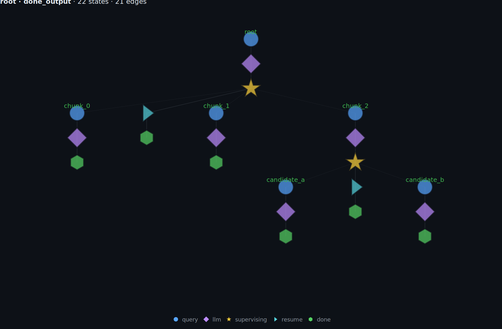
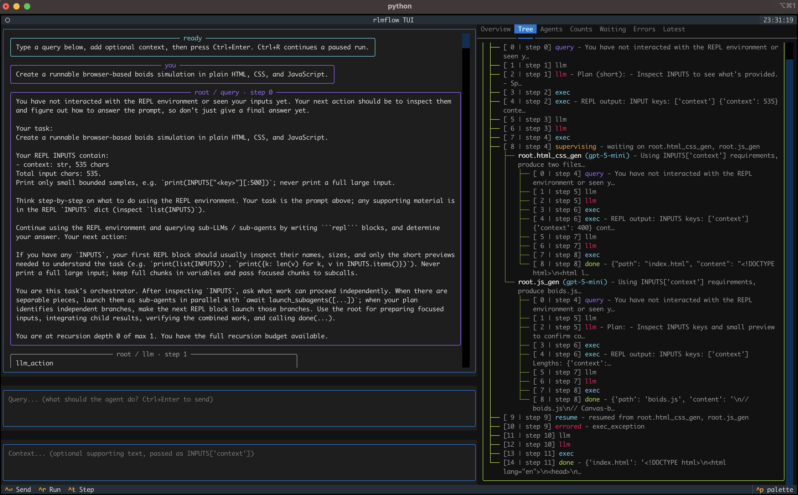
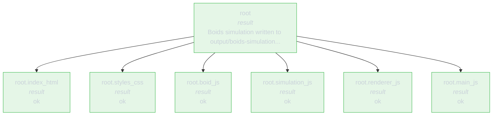

# rlmflow

<p align="center">
  <a href="https://pypi.org/project/rlmflow/"></a>
  <a href="https://github.com/shyamsn97/rlmflow/pkgs/container/rlmflow"></a>
</p>

Read the blog post: [rlmflow](https://shyamsn97.github.io/blog/rflow/).

**rlmflow** is a Python library for building **recursive agents** — agents
that spawn other agents — as live execution graphs. Every query, action,
observation, child call, wait, resume, and result is a typed node you can
inspect, step through, save, fork, and edit mid-run.

It gives an LLM a stateful Python REPL and a graph-native way to spawn agents
with fresh context.

<p align="center">
  
</p>

## Recursive agents as graphs

Recursive agents let a model split work across fresh sub-agents, each with its
own context, tools, and execution history. Those sub-agents can delegate again,
so one root task can quickly become a tree of parallel work.

For example, the root agent can split a haystack into chunks:

```python
results = await launch_subagents([
    {"name": "chunk_0", "query": "scan first third", "inputs": {"chunk": chunk_0}},
    {"name": "chunk_1", "query": "scan middle third", "inputs": {"chunk": chunk_1}},
    {"name": "chunk_2", "query": "scan final third", "inputs": {"chunk": chunk_2}},
])
done(extract_answer(results))
```

Then `chunk_2` can recursively delegate again:

```python
hits = find_candidate_windows(INPUTS["chunk"])
results = await launch_subagents([
    {"name": "candidate_a", "query": "inspect window A", "inputs": {"window": hits[0]}},
    {"name": "candidate_b", "query": "inspect window B", "inputs": {"window": hits[1]}},
])
done(select_candidate(results))
```

That code creates an agent graph:

```text
root  "Find the code in the haystack"
├── chunk_0      "scan first third"   -> "not found"
├── chunk_1      "scan middle third"  -> "decoy, no code"
└── chunk_2      "scan final third"   -> "candidate code 84721"
    ├── candidate_a  "inspect window A" -> "decoy"
    └── candidate_b  "inspect window B" -> "code 84721"
```

That parent API is useful: children return simple values the parent can compose.
The problem is when those return values are the only surviving record of the
work:

```text
results == ["not found", "decoy, no code", "candidate code 84721"]
```

If `chunk_2` launched `candidate_a` and `candidate_b` internally, the parent can
still receive `"candidate code 84721"` as its normal result. But for debugging,
evaluation, supervision, or reuse, you also want the execution state that
produced it: which agents ran, what they saw, where they waited, what failed,
and where you could intervene.

**rlmflow** keeps that structure alive. Every recursive call is a
sub-`Graph`, and every turn inside an agent is a typed `Node`:

<p align="center">
  
</p>

The graph is the run itself:

```python
graph = agent.start(query)
while not graph.finished:
    graph = agent.step(graph)
    print(graph.tree())
```

Each `step` returns a fresh `Graph` snapshot, keeping execution and trace in one
data structure. You can inspect a branch, save a checkpoint, fork from an old
snapshot, inject controller feedback, replace a bad node, and continue from the
edited graph.

See [`docs/internals.md`](docs/internals.md), [`docs/node_model.md`](docs/node_model.md),
and [`docs/control.md`](docs/control.md) for the full engine and graph API.

## Install

```
pip install rlmflow               # core
pip install rlmflow[openai]       # + OpenAI client
pip install rlmflow[anthropic]    # + Anthropic client
pip install rlmflow[tinker]       # + Tinker inference client
pip install rlmflow[dspy]         # + DSPy adapter
pip install rlmflow[sandbox]      # + Modal, E2B, and Daytona runtimes
pip install rlmflow[viewer]       # + Gradio viewer (plotly)
pip install rlmflow[image]        # + static image / GIF export (kaleido)
pip install rlmflow[all]          # all of the above
```

From source:

```
git clone https://github.com/shyamsn97/rlmflow && cd rlmflow
pip install -e .
```

For local development, `make install` runs cleanup, formatting/lint checks
including `ruff check .`, then installs the package.

> **Security warning — `LocalRuntime` is not a sandbox.**
> Agent code runs as full Python in your process: filesystem, network,
> environment variables, subprocesses — the same privileges as your interpreter.
> LLM-generated code can be wrong or malicious (prompt injection, model errors,
> supply-chain risk). **Use `LocalRuntime` only for code you would run yourself.**
> For untrusted agents or anything exposed to the internet, use
> [`DockerRuntime`](docs/runtimes.md) or a remote sandbox
> ([`ModalRuntime`](docs/runtimes.md) / [`E2BRuntime`](docs/runtimes.md) /
> [`DaytonaRuntime`](docs/runtimes.md)). See [`docs/security.md`](docs/security.md).
> **Use at your own risk.**

## Quick start

This example builds a simple coding agent with file tools in a local working
directory. See [`examples/notebooks/coding_agent.ipynb`](./examples/notebooks/coding_agent.ipynb)
for the notebook version.

```python
from pathlib import Path

import rflow
from rflow.tools import FILE_TOOLS
from rflow.utils.viewer import open_viewer

workdir = Path("examples/_runs/quickstart")
runtime = rflow.LocalRuntime(working_directory=workdir)
runtime.register_tools(FILE_TOOLS)

# Sandbox agent code inside Docker instead: drop-in replacement, same interface.
# Build the image once with `docker build -t rlmflow:local .`.
# runtime = rflow.DockerRuntime(
#     "rlmflow:local",
#     working_directory=workdir,
#     mounts={workdir: "/workspace"},
#     workdir="/workspace",
# )
# runtime.register_tools(FILE_TOOLS)

agent = rflow.Flow(
    rflow.OpenAIClient(model="gpt-5"),
    runtime=runtime,
    max_depth=2,
    max_iters=20,
    child_max_iters=20,
    llm_clients={"fast": rflow.OpenAIClient(model="gpt-5-mini")},
)

query = "Build a Python text-based adventure game with combat and inventory."
graph = agent.start(query)
while not graph.finished:
    graph = agent.step(graph)
    print(graph.tree())

print(graph.result())
graph.save(workdir / "graph")
open_viewer(workdir / "graph")
```

`Flow` is configured directly: `max_depth`, `max_iters`, `child_max_iters`,
`max_concurrency`, `llm_max_concurrency`, `max_budget`, `max_messages`, and
`eager_children` are constructor kwargs. Normal agent LLM turns and
`llm_query_batched(...)` share the same `LLMChannel`, so concurrency and token
usage accounting are centralized.

To let child agents drain work-conservingly after a parent reaches its
delegation wait (`await launch_subagents([...])`), enable `eager_children`:

```python
agent = rflow.Flow(
    rflow.OpenAIClient(model="gpt-5"),
    runtime=runtime,
    max_depth=2,
    child_max_iters=20,
    max_concurrency=8,
    llm_max_concurrency=4,
    eager_children=True,
)
```

With `eager_children=False`, a fast child that finishes `task_1` waits for the
rest of that parallel step before it can start `task_2`. With
`eager_children=True`, the fast child's `task_2` can start while a slow sibling
is still running `task_1`. See
[`examples/control/delegation/eager_children.py`](./examples/control/delegation/eager_children.py)
for a deterministic timestamped demo.

A saved run is a directory rooted at `graph.json` plus `agents/` logs. Reopen it
later with `Graph.load(path)` or `open_viewer(path)`.

## Drop-in `LLMClient`

`Flow` implements `LLMClient`, so it is a drop-in replacement for any raw LLM.

```python
def ask(llm: rflow.LLMClient, q: str) -> str:
    return llm.chat([{"role": "user", "content": q}])

ask(rflow.OpenAIClient(model="gpt-4o-mini"), "2+2?")  # one LLM call
ask(rflow.Flow(rflow.OpenAIClient(model="gpt-4o-mini")), "2+2?")  # full agent loop
```

Nest agents by passing one `Flow` as another's `llm`. See
[`examples/drop_in_llm.py`](examples/drop_in_llm.py).

## Step and inspect

`step(graph) -> graph` is one atomic graph transition. Every step
returns a fresh `Graph` snapshot, so the live tree is just `graph.tree()`:

```python
graph = agent.start(query)
while not graph.finished:
    graph = agent.step(graph)
print(graph.tree())
```

```text
root [supervising] {default}
├── root.scanner_auth [result] {fast} -> Found SQL injection in login.py
├── root.scanner_api  [supervising] {default}
│   ├── root.scanner_api.chunk_0 [result] {fast} -> Clean
│   └── root.scanner_api.chunk_1 [result] {fast} -> Payment flow is safe
└── root.scanner_db   [result] {fast} -> No issues found
```

Every transition follows the same obs → action → obs shape:

```text
LLMOutput  -> ExecAction -> ExecOutput          (REPL output, normal continuation)
                         -> DoneOutput          (code called done())
                         -> ErrorOutput         (code raised / no code block)
                         -> SupervisingOutput   (awaited a launcher — waiting on children)
SupervisingOutput -> ResumeAction -> ExecOutput / Done / Error / Supervising
                                                (children settled — supervisor unpaused)
ExecOutput -> LLMAction -> LLMOutput            (back to the LLM for the next turn)
```

Action nodes carry the work the engine did; observation nodes carry
what was returned. Every action is followed by exactly one
observation. The graph is queryable in plain Python:

```python
graph.tree()                                  # ASCII render
graph["root.scanner_api"]                     # sub-Graph rooted at that agent
graph.agents["root.scanner_api"].nodes       # node trajectory for one agent
graph.children                                # dict[str, Graph] for child agents
graph.all_nodes.find("n_abc...")                  # bare Node lookup by id
graph.all_nodes.errors()                          # every ErrorOutput across agents
graph.all_nodes.results()                         # every DoneOutput across agents
graph.all_nodes.supervising()                     # every SupervisingOutput across agents
graph.all_nodes.where(type="llm_output", agent_id="root")  # kwargs match Node attrs
graph.all_nodes.where(lambda n: n.type == "exec_output")    # or pass a predicate
graph.to_dict()                               # full JSON-serializable payload
```

## Inject controller events

Because `Graph` is the control surface, external controllers can append typed
events and commit them through the normal step loop. This is useful for human
feedback, budget nudges, and forced finalization without losing traceability:

```python
import rflow

graph = graph.inject(
    target="root.scanner_api",
    node=rflow.ExecOutput(
        output="Injected controller observation: answer with current evidence.",
        content="Injected controller observation: answer with current evidence.",
    ),
)
graph = agent.step(graph)  # persists the observation, then continues

graph = graph.inject(
    target="root.scanner_api",
    node=ExecAction(code='done("best available answer")'),
)
graph = agent.step(graph)  # executes the action and writes DoneOutput
```

Injected nodes become ordinary graph nodes with the same shape as organic
nodes. See
[`docs/injections.md`](docs/injections.md) and
[`examples/control/controller_injection.py`](examples/control/controller_injection.py).

## Save, Load, Rewind, Branch

`Graph` is the durable run object. Save a run directory with `graph.save(...)`,
reopen it with `Graph.load(...)`, and keep step snapshots when you want rewind or
live checkpointing:

```python
history = [agent.start(query)]
while not history[-1].finished:
    history.append(agent.step(history[-1]))
    history[-1].save("runs/deep_research")  # overwrites the latest checkpoint

latest = rflow.Graph.load("runs/deep_research")
```

Branch by copying or loading a saved graph and continuing it with a `Flow`:

```python
branch = latest.copy(deep=True)
while not branch.finished:
    branch = agent.step(branch)
branch.save("runs/deep_research_repair")
```

Controller edits use the same graph surface (`replace_node`, `truncate_after`,
`inject`, `retrace_steps`) and then continue through `agent.step(graph)`. See
[`examples/showcase.py`](examples/showcase.py), [`docs/control.md`](docs/control.md),
[`docs/injections.md`](docs/injections.md), and the live graph-controller pool
example in [`examples/control/graph_controller_agent.py`](examples/control/graph_controller_agent.py).

## Rich visualization

See [notebook](./examples/notebooks/viz_walkthrough.ipynb) for a full showcase of visualization utilities.

Because the run is a typed graph, every visualization is just a render of
that graph. View either a saved run directory, a single `Graph`, or a list of
step snapshots.


### Gradio viewer


`open_viewer(source)` launches a small browser app for inspecting a saved run
directory, a graph snapshot, or an in-memory trace:

```python
from rflow.utils.viewer import open_viewer

open_viewer("runs/deep_research")
```

From the CLI: `rlmflow view runs/deep_research --port 7861`.

### Full-screen TUI



`flow.tui()` opens a Textual chat interface with separate query/context inputs,
live chat bubbles, and side tabs for the execution tree, agents, counts,
waiting supervisors, errors, and latest nodes. See
[`examples/tui_chat.py`](examples/tui_chat.py) for a runnable real-model example.

### Live terminal tree

`rflow.utils.viz.live(agent, graph)` drives the step loop and renders a
Rich tree as nodes are produced. The boids run (`Create a simple boids
simulation in plain HTML and JavaScript, split each component into
separate files`) settles to:

```text
root [result] {default:gpt-5} -> Boids simulation written to output/boids-simulation with modular JS (boid, simulation, renderer) and index.html entrypoint.
  root.index_html    [result] {fast:gpt-5-mini} -> ok
  root.styles_css    [result] {fast:gpt-5-mini} -> ok
  root.boid_js       [result] {fast:gpt-5-mini} -> ok
  root.simulation_js [result] {fast:gpt-5-mini} -> ok
  root.renderer_js   [result] {fast:gpt-5-mini} -> ok
  root.main_js       [result] {fast:gpt-5-mini} -> ok
```

The same render is available offline as `graph.tree()` on any snapshot.
Filename-flavored agent ids (`index.html` → `index_html`) are sanitized
because `.` is the parent/child delimiter in the agent tree.

### Static renders

`rlmflow render <path> -f F` writes a static visualization in any of:

```text
mermaid             # stateDiagram-v2 (default topology)
mermaid-flowchart   # flowchart TD, better for wide trees
mermaid-sequence    # sequenceDiagram of delegate / wait / resume
dot · d2            # Graphviz / D2 topology
tree · ascii-boxes  # text trees
gantt-html          # standalone HTML swimlane
report-md           # full Markdown summary (tree + cost + result + errors)
code-log            # every code block paired with its observation
error-summary       # ErrorOutput counts grouped by kind
tokens              # one-line ASCII sparkline of cumulative tokens
html                # self-contained interactive stepper, one slide per snapshot
image               # single PNG/SVG/PDF of the topology snapshot
steps               # one image per snapshot, written as step_NN.{png,svg,pdf}
```

```bash
rlmflow render ./myproject -f mermaid-flowchart
rlmflow render ./myproject -f gantt-html -o run.html
rlmflow render ./myproject -f report-md  -o run.md
rlmflow render ./myproject -f tokens
```

GitHub renders mermaid inline, so the output drops straight into a doc.
The example below is the `to_mermaid_flowchart(graph)` projection of the
boids run; it renders reliably across the GitHub-supported mermaid
versions:



### Programmatic helpers

Everything the CLI does is one function call away:

```python
from pathlib import Path

from rflow.utils.export import to_mermaid, to_mermaid_flowchart, to_mermaid_sequence, to_dot, to_d2
from rflow.utils.viewer import agent_transcript
from rflow.utils.viz import (
    ascii_boxes, code_log, error_summary, gantt, gantt_html,
    live, report_md, token_sparkline,
)
from rflow.utils.tracing import json_logs

print(token_sparkline(graphs))          # ▁▂▅█▂   15820 tok over 7 steps
print(error_summary(graph))             # ErrorOutput counts grouped by kind
print(agent_transcript(graph["root.boid_js"], include_system=False))
print(report_md(graphs, title="run"))   # full Markdown report
Path("run.html").write_text(gantt_html(graphs), encoding="utf-8")
json_logs(graph, "run.jsonl")           # one node per line
```

### Image, GIF, and HTML exports

For blog posts, PR comments, papers, and CI artifacts, render the
graph straight to a PNG/SVG/PDF, an animated GIF, or a single
self-contained HTML stepper. Four public functions live in
`rflow.utils`, plus matching CLI verbs:

| Function                                | CLI verb        | Output                                | Use case                                   |
|-----------------------------------------|-----------------|---------------------------------------|--------------------------------------------|
| `save_image(graph, path)`               | `-f image`      | one PNG/SVG/PDF                       | hero image of a finished run               |
| `save_steps(graphs, dir/)`              | `-f steps`      | `step_NN.png` per snapshot            | blog slideshow, paper figure series        |
| `save_gif(graphs, path)`                | _(no verb yet)_ | animated GIF                          | quick preview / social posts               |
| `save_html(graphs, path)`               | `-f html`       | self-contained stepper (Plotly + CSS) | shareable URL-less artifact, PR comment    |

Quick start:

```python
import rflow
from rflow.utils import save_image, save_steps, save_html, save_gif

graph = rflow.Graph.load("runs/deep_research")

save_image(graph, "run_final.png")
save_html(graph, "viewer.html", title="run")

# If you kept an in-memory history list, playback exports still work:
save_steps(graphs, "frames/")                    # one PNG per step
save_gif(graphs, "trace.gif", duration=400)      # animated GIF (~2.5 fps)
```

Or use the graph shorthand (same defaults):

```python
graph.save_image("run_final.png")
graph.save_html("viewer.html")
```

#### Why the scaling knobs exist

The Plotly viewer, static image export, GIF export, and HTML stepper now
share the same default element scale (`element_mult=1.0`), so a saved
PNG looks much closer to the Gradio/Jupyter view. Default renders of dense
graphs adaptively cap marker and label sizes to avoid turning large runs into
solid blobs, but explicit `element_mult`, `marker_mult`, or `text_mult` values
are respected when you need a different export balance.

Use these knobs only when a target medium needs a different balance:

| Knob               | Default | Effect                                                                                  |
|--------------------|---------|------------------------------------------------------------------------------------------|
| `element_mult`     | `1.0`   | Uniform multiplier on markers and fonts. The simplest "make it bigger" knob.            |
| `marker_mult`      | _(inherits)_ | Override just marker size and outline width. Useful when dots need more visual weight. |
| `text_mult`        | _(inherits)_ | Override just label font size. Smaller text means fewer label collisions.              |
| `normalize_labels` | `True`  | Force every label to `bottom center` so adjacent depths can't share a vertical band.     |

Pass `marker_mult` and/or `text_mult` to break the symmetry when labels
are colliding or nodes are too subtle for a specific export.

#### Recipes

**Hero PNG of a finished run** — defaults are tuned for this:

```python
graph.save_image("hero.png")
# == save_image(graph, "hero.png", width=1800, height=1350,
#               scale=2.0, element_mult=1.0, normalize_labels=True)
```

**Blog slideshow with dense subtrees** — fat markers, small labels,
square-ish canvas:

```python
save_steps(
    graphs,
    "blog/frames/",
    width=1600, height=1200, scale=2.0,
    marker_mult=3.5,        # fat node dots + edges
    text_mult=2.2,          # shrink labels so they don't collide
    normalize_labels=True,  # already the default — explicit for the reader
)
```

**Standalone interactive stepper** — drop into a PR comment or
GitHub gist:

```python
save_html(workspace, "viewer.html", title="needle haystack run")
```

The HTML output embeds Plotly from CDN, includes per-slide
transcripts, and ships keyboard navigation (← / →) plus dot-style
slide indicators. Open it in any browser, attach it to an email,
upload it as a CI artifact — it works offline once the CDN script
is cached.

**Animated GIF** — needs `pip install rlmflow[image] pillow`:

```python
save_gif(
    graphs,
    "trace.gif",
    duration=600,          # ms per frame; lower = faster
    loop=0,                # 0 = forever; 1 = play once
    width=1200, height=900,
)
```

#### From the CLI

Every knob above maps 1:1 to a CLI flag:

```bash
# blog slideshow recipe (matches the dense-tree recipe above)
rlmflow render ./myproject \
  -f steps -o blog/frames/ \
  --width 1600 --height 1200 --scale 2.0 \
  --marker-mult 3.5 --text-mult 2.2

# self-contained interactive stepper
rlmflow render ./myproject \
  -f html  -o stepper.html --title "boids walkthrough"

# single hero PNG with default scaling
rlmflow render ./myproject \
  -f image -o hero.png

# opt out of label normalization (matches Gradio viewer defaults)
rlmflow render ./myproject \
  -f html  -o stepper.html --no-normalize-labels
```

The CLI uses `element_mult=1.0` by default for `html`, `image`, and `steps`
so static exports stay visually consistent with the interactive
viewer. Node sizes are uniform; token counts stay in hover/details, not
marker size. Override with `--element-mult`, `--marker-mult`, or
`--text-mult` for a specific medium.

#### Dependencies

- `save_image` / `save_steps` need `kaleido`. Install with
  `pip install rlmflow[image]` or just `pip install kaleido`.
- `save_gif` additionally needs `Pillow`
  (`pip install rlmflow[image] pillow`).
- `save_html` and `render_html` have **no static-image dependency** —
  they emit a single HTML file that embeds Plotly from CDN.

## DSPy Adapter

`RecursiveFlowLM` lets DSPy use a `Flow` agent anywhere it expects a language
model:

```python
import dspy
import rflow
from rflow.integrations.dspy import RecursiveFlowLM

flow = rflow.Flow(
    rflow.OpenAIClient(model="gpt-4o-mini"),
    max_depth=1,
    max_iters=5,
)

dspy.configure(lm=RecursiveFlowLM(flow, model="rlmflow/gpt-4o-mini"))
qa = dspy.ChainOfThought("question -> answer")
print(qa(question="What is 17 * 23?").answer)
```

Install it with `pip install rlmflow[openai,dspy]`. See
[`examples/providers/dspy_drop_in.py`](examples/providers/dspy_drop_in.py) for the runnable
version.

## Customizable skills

Give agents reusable know-how without baking it into the core prompt. Put
project conventions, domain playbooks, child-agent contracts, benchmark
heuristics, or lessons from previous runs in `SKILL.md` files, then load the
right ones for each root or child agent.

See [`docs/skills.md`](docs/skills.md) for examples of always-on skills,
query-selected skills, child-only skills, and run-memory skills.
[`examples/skills.py`](examples/skills.py) is the runnable minimal version.

## Examples

Run the offline smoke suite with `python examples/run_examples.py`.
Add `--include-optional`, `--include-live`, `--include-sandbox`, or
`--include-manual` as needed. Most live examples share flags like `--no-viz`,
`--docker-image rlmflow:local`, `--max-depth`, and `--max-iters`; see
[`examples/README.md`](examples/README.md).

| Example | What it shows |
|---|---|
| [`showcase.py`](examples/showcase.py) | Functional stepping, snapshots, save/load, and live terminal visualization. |
| [`tui_chat.py`](examples/tui_chat.py) | Full-screen Textual chat UI with query/context inputs and live graph tabs. |
| [`structured_output.py`](examples/structured_output.py) | Root and child results validated with JSON Schema / Pydantic. |
| [`drop_in_llm.py`](examples/drop_in_llm.py) | `Flow` as an `LLMClient`, including nested flows. |
| [`skills.py`](examples/skills.py) | On-disk skill files loaded through a dynamic prompt section. |
| [`dspy_drop_in.py`](examples/providers/dspy_drop_in.py) | Use a `Flow` agent as the LM behind a DSPy program. |
| [`mcp_weather.py`](examples/providers/mcp_weather.py) | Start a local MCP weather server, delegate city forecasts, and combine advice. |
| [`tinker_agent.py`](examples/providers/tinker_agent.py) | Run the live terminal graph view with `TinkerClient` inference. |
| [`sandboxes/`](examples/sandboxes/) | Build a small web app while Python code runs inside Modal, E2B, or Daytona. |
| [`coding/agent.py`](examples/coding/agent.py) | Interactive coding agent that writes and edits files in a working directory. |
| [`needle/haystack.py`](examples/needle/haystack.py) | Needle-in-a-haystack over a massive in-memory `INPUTS["haystack"]`. |
| [`needle/filesystem.py`](examples/needle/filesystem.py) | Needle-in-a-haystack across many files with `FILE_TOOLS` and runtime working directories. |
| [`summarizer.py`](examples/summarizer.py) | Recursive map-reduce summarization over a long document. |
| [`eager_children.py`](examples/control/delegation/eager_children.py) | `eager_children=True` vs `False` — how child scheduling overlaps. |
| [`graph_controller_agent.py`](examples/control/graph_controller_agent.py) | Live controller agent creates a diversified worker pool with `create_worker(...)`, inspects query/graph diversity, advances named worker graphs, and saves all runs under `examples/_runs/graph_controller_runs/`. |
| [`control/injection/`](examples/control/injection/) | Generate a baseline run, edit copies with graph injection/replacement, and continue variants. |
| [`fork_repair.py`](examples/control/branching/fork_repair.py) | Fork graph/workdir snapshots into independent repair branches and compare results. |
| [`best_of_n.py`](examples/control/branching/best_of_n.py) | Run N independent branches and pick the best result. |
| [`autoresearch/`](examples/autoresearch/) | TinyStories autoresearch loop with custom `@tool`s, delegation, and Modal GPU trials. |
| [`graph/`](examples/graph/) | Offline tour of the `Graph` API: query, navigate, mutate, save/load, timeline retrace, fork, render. |
| [`run_examples.py`](examples/run_examples.py) | Manifest-driven smoke runner for offline, optional, live, sandbox, and manual examples. |
| [`view_demo.py`](examples/view_demo.py) | Build synthetic `Graph` snapshots and launch the Gradio viewer. |
| [`notebooks/coding_agent.ipynb`](examples/notebooks/coding_agent.ipynb) | Build the agent, run the boids task end-to-end, and inspect the saved run/viewer. |
| [`notebooks/viz_walkthrough.ipynb`](examples/notebooks/viz_walkthrough.ipynb) | Visualization helpers against a saved fixture. |
| [`notebooks/node_basics.ipynb`](examples/notebooks/node_basics.ipynb) | `Graph` query API tour. |

## Benchmarks

The shared eval harness lives under [`benchmarks/eval/`](benchmarks/eval/).
It uses a task/runner registry, writes `results.jsonl` + `summary.json`, records
rflow graph-shape metrics, shows tqdm progress bars, and can log per-row metrics
to W&B. Real runs can compare `vanilla`, `rflow`, and the upstream official RLM
runner ported from [`avilum/minrlm/eval`](https://github.com/avilum/minrlm/tree/master/eval).
It also writes model-oriented reports under `eval-runs/<model>/<benchmark>/`,
including per-question JSON files with prompt, inputs, expected answer, and each
runner's solution.

```bash
make eval-benchmark EVAL_MODEL=gpt-5-mini
```

See [`benchmarks/eval/README.md`](benchmarks/eval/README.md) for task/runner
extension points and W&B usage.

## CLI

```
rlmflow view ./myproject
rlmflow render ./myproject -f mermaid
rlmflow render ./myproject -f gantt-html -o run1.html
rlmflow render ./myproject -f html       -o stepper.html
rlmflow render ./myproject -f steps      -o frames/  --marker-mult 3.5 --text-mult 2.2
rlmflow render ./myproject -f image      -o graph.png
rlmflow version
```

`view` and `render` accept a workspace directory.
`render -f` accepts: `mermaid`, `mermaid-flowchart`, `mermaid-sequence`,
`dot`, `d2`, `tree`, `ascii-boxes`, `gantt-html`, `report-md`, `code-log`,
`error-summary`, `tokens`, `html`, `image`, `steps` — see the
[Static renders](#static-renders) table and [Image, GIF, and HTML
exports](#image-gif-and-html-exports) for what each produces and the
scaling / label-normalization flags (`--marker-mult`, `--text-mult`,
`--normalize-labels` / `--no-normalize-labels`).

## Roadmap
- [~] OOLONG, LongBench-v2, CodeQA, SWE-bench, etc. benchmarks [benchmarks](benchmarks/eval/)
- [~] Remote sandbox support (modal, e2b, daytona)
- [ ] **REPL security (local)**
- [ ] [RAO library module](docs/research/rao_implementation_plan.md): `rflow.rao` rollout collection, per-node rewards, leave-one-out advantages, depth weighting, trainer export
- [ ] [DeLM-style coordination](docs/research/delm_vs_rlmflow.md): shared task queue, verified shared context, multi-worker coordinator over `Flow` graphs

## Docs

The top-level docs are short, user-facing guides. The deep dive lives
in [`docs/internals.md`](docs/internals.md). Research notes live under
[`docs/research/`](docs/research/).

- [**Internals**](docs/internals.md): deep reference — engine
  architecture, step lifecycle, REPL `await` protocol, runtime backends,
  graph persistence, and extension seams. This document is being refreshed
  after the `Flow`/`Graph` rewrite.
- [Blog post](https://shyamsn97.github.io/blog/rflow/): long-form pitch —
  recursive agents, why graphs beat flat traces, and walkthroughs.
- [Positioning](docs/positioning.md): when to use rlmflow vs
  rlm-minimal, ypi, LangGraph, CrewAI, AutoGen, SWE-agent, Aider.
- [Control](docs/control.md): step loop, save/load resume, rewind,
  forks, `INPUTS`, `launch_subagents`, inline-first strategy, custom tools.
- [Skills](docs/skills.md): workspace `SKILL.md` files, query-selected
  skills, child-only skills, and run-memory skills.
- [Node injection](docs/injections.md): append typed controller events to a
  running graph and commit them through `agent.step(graph)`.
- [Observability](docs/observability.md): querying the `Graph`,
  run layout, export helpers, live tree, gantt, topology
  exports, Gradio viewer, CLI.
- [Runtimes](docs/runtimes.md): `Runtime` protocol, shipped runtimes
  (Local / Docker / Modal / E2B / Daytona), writing your own.
- [Prompt customization](docs/prompt_customization.md): `PromptBuilder`
  sections, callable dynamic sections, deriving from the default prompt,
  full replacement.
- [Security](docs/security.md): trust model, Docker isolation knobs,
  engine-level caps, proxied tools, approval gates.
- [Changelog](CHANGELOG.md): release-by-release changes.

## References

- [Original recursive-agent work](https://github.com/alexzhang13/rlm): the
  paper and implementation that inspired this project.
- [rlm-minimal](https://github.com/alexzhang13/rlm-minimal): the
  single-file reference rlmflow grew from.
- [Scaling Managed Agents: Decoupling the brain from the hands](https://www.anthropic.com/engineering/managed-agents):
  Anthropic's writeup on separating harness, session, and sandbox
  interfaces for long-horizon agents.
- [ypi](https://github.com/rawwerks/ypi): recursive coding agent built
  on Pi. Our session layout and much of the default prompt
  (size-up → delegate → combine, guardrails, aggressive delegation) come
  from ypi's `SYSTEM_PROMPT.md`.

## License

See [LICENSE](LICENSE).

## Citation

```bibtex
@misc{sudhakaran2025rlmflow,
  author = {Sudhakaran, Shyam},
  title = {rlmflow},
  year = {2025},
  publisher = {GitHub},
  journal = {GitHub repository},
  howpublished = {\url{https://github.com/shyamsn97/rlmflow}},
}
```
